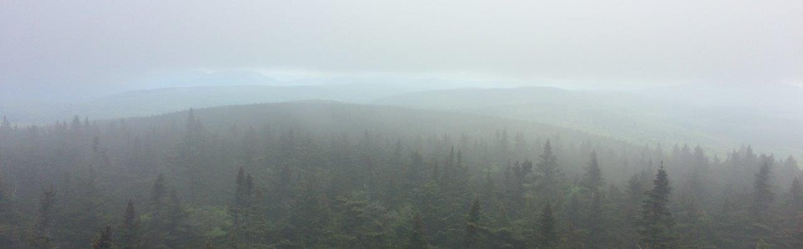
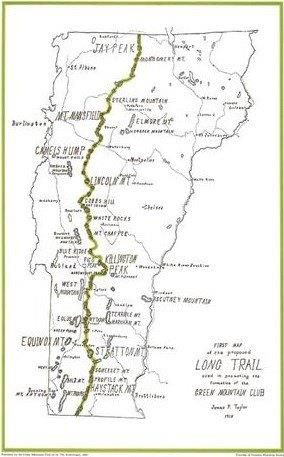
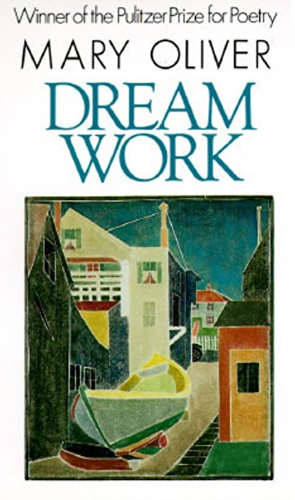

```{r setup, include=FALSE}
library(knitr)
knitr::opts_knit$set(root.dir = "C:/Users/Harrison/Documents/Website")
knitr::opts_chunk$set(message = FALSE, tidy = TRUE, echo = FALSE, fig.show="hold", warning = FALSE, 
                      cache = TRUE, fig.align = "center", fig.retina = 1)
```

```{r}

```

# A little background
***

The Long Trail (or the LT) is a 272-mile long foot trail along the spine of the Green Mountains in Vermont, from Massachusetts to Quebec. Constructed between 1910 and 1930 by the Green Mountain Club, the LT is the *oldest* long-distance hiking trail in the United States.


```{r ltmap,  out.height = "30%", out.width="30%", fig.cap = "The original (circa 1910) Long Trail map by James Taylor."}

```

That's right. Before the Appalachian Trail, the Pacific Crest Trail, the Continental Divide Trail, and all the rest, there was the Long Trail. Traversing the entire length of the state of Vermont, through thick forests and scenic mountaintops, the LT has charmed outdoor enthusiasts for over a century. And despite being much shorter than its Triple Crown cousins, the LT is no mere walk in the woods. Most hikers require between 20 to 30 days to complete the journey, facing the full fanfare of thru-hiking thrills, including temperature extremes, torrential rain, masses of black flies and mosquitos, ankle-deep muck, stream fords, steep climbs, and dangerous descents. 

I've been enchanted by the Long Trail since the fall of 2012, when I spent a week in Vermont as part of the Environmental Field Semester at Brandeis University. The trail's presence loomed large in the Green Mountain state, often mentioned by locals and well advertised by the beer selection of every grocery store and gas station. We didn't actually hike on the Long Trail while in Vermont, instead touring farmlands and lesser known tracts of forest from Shelburne to Marshfield. But at some point, while eating my weight in cheese at the Cabot factory, I knew I had to come back to see this trail for myself.

What followed were five years of Long Trail teasers. I got my first glimpse of the trail in June of 2013 from my road bike while riding across Brandon Gap with Bike & Build.


```{r vermont2013, out.height = "50%", out.width= "50%", fig.cap = "Biking through Vermont with Bike & Build in summer of 2013."}
knitr::include_graphics("images/vermont2013.jpg")
```


Intrigued by the brief glimpse of a trailhead and sweaty hikers, I returned three years later in August of 2016 to hike a section from Middlebury Gap to Appalachian Gap. Thoroughly impressed by the Breadloaf Wilderness, I came back a year later to hike the next section from Appalachian Gap to the Winooski River.


```{r vermont 2016, out.width = "50%", out.height = "50%", fig.show = "hold"}
knitr::include_graphics("images/vermont2016.jpg")
```


```{r vermont 2017, out.width = "50%", out.height = "50%", fig.show = "hold", fig.cap = "Past treks on the Long Trail, in 2016 (top image, in the Breadloaf Wilderness) and 2017 (bottom image, atop Camel's Hump)."}
knitr::include_graphics("images/vermont2017.jpg")
```


At the end of this trip I was convinced that I had to hike the entire thing. And one year later I did just that.

The following are journal entries and photos from my northbound thru-hike on the Long Trail in June of 2018. In total I hiked for 22 days and rested for four, making the whole journey 26 days long from end-to-end. I mostly hiked alone, meeting new people along the way, and was joined by the one and only Theresa Fuller for the final 90 miles from Camel's Hump to Canada. 

I went along without much outside entertainment, save some music (read through to the end of Part 3 to find a personally curated Long Trail-themed Spotify playlist), short stories by Jorge Luis Borges, and poems by Mary Oliver, whose 1986 collection [Dream Work](https://groveatlantic.com/book/dream-work/){target="_blank" rel="noopener"} supplied the daily rhythm and mystic energy for my tramping in the Green Mountains. 

```{r, out.height = "30%", out.width = "30%"}

```


And so we begin...

***

# Day 1---Dogfish

**June 1, 2018: North Adams, MA to unnamed beaver pond (10.2 miles).**

>...I wanted to know,  
whoever I was, I was  
alive  
for a little while.
>
>--- (Oliver, lines 22-24)

***

Disaster! *Everything* is going wrong!

Let me explain.

Today I set off on my first day on the trail. I arrived at the parking lot at the Greylock Community Club at 2:00PM, much later than I wanted to arrive and start the hike. 


```{r southern sign, out.height = "50%", out.width= "50%", fig.cap = "Sign at the southern terminus of the Long Trail in North Adams, MA."}
knitr::include_graphics("images/ltsouthernsign.jpg")
```


What followed was a series of escalating mishaps and failures.

1. I missed the sign for the shelter I wanted to stay in tonight.

2. I ran out of water with no clear restock locations nearby on the map.

3. When I *finally* found water at an unnamed beaver pond, my Sawyer decided to stop producing a quick flow. I had to practically sit on the thing to get the water.

4. I almost lost my water bottle in a tree when hanging up my food.

5. It started raining while I was cooking. So I didn't really have dinner.

6. Hammock camping is **not easy** with this mattress pad.

7. That's about it.

On the plus side, I met some cool hikers today, both AT-ers and LT-ers. More about them later. And aside from all the mishaps, the trail has been really great so far! There was a large patch of American chestnut seedlings and saplings right after hitting the Vermont border. Really happy to be back in the woods again after being glued to my computer for the past ten months.


```{r beaver pond, out.height = "50%", out.width= "50%",  fig.cap = "Camping location for first night on the trail by unnamed beaver pond."}
knitr::include_graphics("images/beaverpond.jpg")
```


Oh, and I got the wrong batteries for my headlamp! That was unfortunate.

***

# Day 2---Morning Poem

**June 2, 2018: Unnamed beaver pond to Goddard Shelter (17.6 miles).**

>If it is your nature  
to be happy  
you will swim away along the soft trails  
for hours, your imagination  
alighting everywhere.
>
> --- (Oliver, lines 14-18)

***

Today was rough. Pain, oh so much pain.

Didn't get much sleep on account of the chorusing peepers and green frogs.

The morning hike wasn't too bad. Met a man in his 50s named "Timezone." He and I walked together for a while, talking about practically everything. Personal lives, careers, coding. He is going to Maine on the AT. We zoomed along the trail, across misty forest and meadows, chatting away the morning.


```{r meadow, out.height = "50%", out.width= "50%", fig.cap = "The misty meadow trail to Goddard shelter."}
knitr::include_graphics("images/goddardmeadow.jpg")
```


The day got *really hard* after the road (VT-9). Steep ups and downs. It was only tolerable thanks to a woman I hiked with named Alyssa. Her hiking buddy hurt her leg, so she was alone. Also doing the LT. We wonderfully shared the sufferfest that was the hike to Goddard's Shelter.

I have never been so happy to lay down. God, it feels so good to *not* be hiking. Why do we do this to ourselves? 
Critters seen:

- Garter snakes (2)
- Leopard frog
- Eastern red newt (many, so many)
- Spring peeper (2, at the damn shelter, causing a damn ruckus in the middle of the night!)

***

# Day 3---The Chance to Love Everything

**June 3, 2018: Goddard Shelter to Stratton-Arlington Road (13.3 miles).**

>All summer I made friends  
with the creatures nearby.
>
> --- (Oliver, lines 1-2)

***

I set out today from Goddard Shelter at 7AM with Alyssa and a man named Rob whom we met last night at the shelter. We all had different destinations in mind: Alyssa's to Story Spring Shelter (9 miles). Rob's to Stratton Pond Shelter (20 miles). And mine to Stratton-Arlington Road (13 miles), where I was picked up by my friend Sam in the afternoon.

Yes, you read that right. I am being picked up by a friend on the third day, with 230 miles remaining to Canada! This was actually planned for over a week now. Sorry, let me back up.

Next weekend is my 5th Reunion at Brandeis. Originally, I had planned to start the Long Trail immediately after Reunion. But time restrictions (a wedding) got in the way and I decided to start hiking a week early. This was beneficial for two reasons: (1) to cut off some early mileage so I can have a more relaxed pace later on when the trail gets rougher, and (2) to serve as a "test run" for my gear. This was very clearly a good decision, seeing I have many issues with my gear that I can now address in the interim.

But I guess I'm technically not a "thru-hiker." 

Anyway, I hiked about 13 miles to the road. I spent much of that with Rob, a retired Vermont State forester who was section hiking the LT. Rob and I got along quite well. He taught me many understory plants and I shared my knowledge and enthusiasm about the many salamanders we encountered along the trail. He was quite knowledgeable about forest ecology and history and we spoke at length about my master's research and the American chestnut (he even knew about the transgenic chestnut at ESF!). 

The hike was quite nice today. Lot's of rolling ups and downs along a ridge with many crisp mountain streams. Not too many views though. It was hot and buggy when we stopped for lunch at Story Spring Shelter at noon. Since I had time to spare before meeting Sam at the road, I felt compelled to have a quick and shaded hammock nap. A little while later and just like that Rob, Alyssa, and I split up.

It's kind of sad when you think about it. We all come and go on this trail, and most meetings are brief encounters. Despite the brevity and sheer randomness, these encounters somehow seem more special than your regular meetings in civilization, as if they are glazed with some serendipitous spark on the trail. I think the remote setting brings people together more easily. We crave human interaction, and let our guards down just enough to bypass acquaintanceship right to friendship and intimacy. Or at least a mirage of friendship and intimacy. Soon enough, we split ways and the mirage disappears, making room for the next one up the trail.

I wonder if I'll ever see Alyssa and Rob again. Real friendships or not, I'll miss them.

***

# Day 4---Trilliums

**June 10, 2018: Stratton-Arlington Road to Stratton Pond Shelter (6.9 miles).**

>I listened to the earth talk,  
\ \ the root wrangle,  
\ \ \ \ the arguments of energy...
>
> --- (Oliver, lines 25-27)

***

Back on the trail!

Hiked 6.9 miles to Stratton Pond Shelter, which was blissful. Clear day, 65 degrees. 

Views from the fire tower on Stratton Mountain were great. 


```{r stratton fire, out.width = "50%", out.height = "50%", fig.show = "hold", fig.cap = "View from the Stratton Mountain fire tower."}
knitr::include_graphics("images/strattonfiretwr.jpg")
```


Very buggy. I met three AT-ers at the fire tower. They were singing folk songs as they stuffed peanut butter wraps in their mouths. One of them---a young man---was named Gandalk on account of the pipe he carried, puffing smoke along the trail.

I also met two LT-ers hiking NOBO (northbound). I stayed at the Stratton Pond Shelter with one of them, a nice history graduate student from Montreal named Sam. The shelter was huge---two floors *with* bunks space that could hold at least 12 people. Somehow this massive backcountry cabin was empty tonight, except for the two of us. We chatted for a while about our initial time on the trail. This isn't his first attempt at the LT. He's made two attempts in the past, neither of which were successful after succumbing to hiking injuries. Unfortunately, his foot has been hurting the last few days. The universe really seems to have it out for this guy.


```{r stratton shelter, out.width = "50%", out.height = "50%", fig.show = "hold", fig.cap = "The massive Stratton Pond shelter."}
knitr::include_graphics("images/strattonshelter.jpg")
```


My real blissful moment today was spending two hours baking in the sun out on Stratton Pond and dunking my feet in the cool water. There were lots of newts swimming in the pond, brushing past my toes with their tails.


```{r stratton pond, out.width = "50%", out.height = "50%", fig.show = "hold", fig.cap = "Stratton Pond."}
knitr::include_graphics("images/strattonpond.jpg")
```


I made a fire too! All in all it was a great first day back. 

Also, in preparation for this first long stretch back on the trail I made a bunch of lentil stew mixes for dinners. I really do enjoy backcountry cooking, and simple ramen or instant meals usually don't do it for me. The stew turned out phenomenal. I'm looking forward to eating this every night!

***

# Day 5---Rage

**June 11, 2018: Stratton Pond to Bromley Mountain Summit (13.5 miles).**

>You are the dark song  
of the morning;  
serious and slow...
>
> --- (Oliver, lines 1-3)

***

Another great day.

Hiked 13.5 miles to the Bromley Mountain Summit and stayed in the skiers' warming hut. What a treat! Four walls! Insulation! **Warmth.**


```{r bromley, out.width = "50%", out.height = "50%", fig.show = "hold", fig.cap = "Bromley Mountain ski summit, with warming hut to the right."}
knitr::include_graphics("images/bromley1.jpg")
```


```{r bromley view, out.width = "50%", out.height = "50%", fig.show = "hold", fig.cap = "View from the Bromley ski lift."}
knitr::include_graphics("images/bromleylift.jpg")
```


Good hiking too. Pretty flat 'til the climb up Bromley. Clear skies, 60s.

Great view of Manchester from Prospect Rock.


```{r manchester, out.width = "50%", out.height = "50%", fig.show = "hold", fig.cap = "Town of Manchester, VT, as seen from Prospect Rock."}
knitr::include_graphics("images/manchesterview.jpg")
```


Sam's foot was hurting real bad, so he left the trail. I feel bad for him. He's hoping to rest up and come back this summer to conquer the rest of the LT, but unlikely we'll see each other again. He would have made a good companion to Canada.

***

# Day 6---Wild Geese

**June 12, 2018: Bromley Mountain Summit to Little Rock Pond (17 miles).**

>You do not have to be good.  
You do not have to walk on your knees  
for a hundred miles through the desert, repenting.  
You only have to let the soft animal of your body  
\ \ love what it loves.
>
> --- (Oliver, lines 1-5)

***

Good hiking today. Pretty views and fun people!

I caught a glimpse of the sunrise from Bromley during my morning pee. 

My foot was bothering me today, probably from overtightening my laces yesterday. It got progressively worse throughout the day---the upper area between my ankles.

It's amazing how easy it is to get in your head when you get an injury. 

*You can go home. You're toast. You can't hike to Canada with a bad foot.* 

These thoughts were stuck in my head all day. I really began to relate to poor Sam and his foot! Not me too!

But like Elizabeth Warren, I persisted. Made it to Rock Pond, a beautiful shelter on a pristine pond. 

The shelter was packed when I got there at 6pm but there was still a top bunk available for me. 

Made good friends with some AT-ers and a father-son LT pair there. A bunch of us hung out on the shore of the pond at night, talking for hours about our various shenanigans on the trails. A man from England was there carrying a British flag filled with quotes and signatures from the various hikers he's encountered along the AT. We passed it around, making our marks in black Sharpie.

The highlight of the evening was watching a young man and woman across the pond and imagining their life stories from hundreds of feet away. We named the man Chad and the woman Brittany. Chad and Brittany were on their first date. Chad takes all his dates to this spot on the pond, where he tries to impress them by jumping off a tall boulder into the clear water. He climbed up while she sat at the shore with her legs in the water. Chad stalled at the top for what seemed like ages, seemingly afraid of his big dive. Brittany didn't seem to care one way or the other. He finally jumped and we all cheered and clapped like lunatics. Poor Chad.

Tomorrow is a resupply day!

***

# Day 7---Knife

**June 13, 2018: Little Rock Pond to Clarendon Shelter (13.6 miles).**

>It was the sheer, dense wall  
of blind stone  
without a pinch of hope  
or a single unfulfilled desire  
sponging up and reflecting,  
so brilliantly,  
as it has for centuries,  
the sun's fire.
>
> --- (Oliver, lines 29-36)

***

Foot pain kept up until lunch, when I iced my foot with some cold creek water. That *really* helped. Very little pain the rest of the day.

I hiked with a nice old man named "Lightened Up" after lunch en route to the road. We were thinking it would rain so we rushed down the mountain to our next shelter just beyond the road.

The resupply (Loretta's Deli) was decent. Luckily, I didn't need much food except snacks. But the real treats were the sandwiches I got for Lightened Up and me (turkey for him, meatball sub for me) and some cold IPAs. We split up when we got to the road, him to the shelter and me to the deli one mile up the road. As we parted I asked him if he wanted me to get him anything. In typical bedazzled hiker fashion, he was happy to get any treats from civilization so I had to pry him for specifics. 

"Meat?" I asked. 

"Yeah, sure. Anything."

"Any meat in particular?" 

"Um, turkey."

"Great. Anything to go on your turkey or just meat and bread?"

"Oh. Umm...lettuce. Tomato." 

Lightened Up then fell silent, seemingly lost in thought about his turkey sandwich.

"Mayo? Mustard?"

"Yeah. Both. Anything."

The sky was darkening and starting to rumble as I returned to the trail. The owner of the deli offered me a ride to the trailhead which I immediately accepted. It was rough going up the last mile to the shelter with all that extra weight of those subs and beers. But so worth it.

It looks like I might make it to Killington tomorrow (2 days ahead of schedule!). I think I'll take a full day off at the Inn in Killington or the Yellow Deli in Rutland.

Wonderful night here at Clarendon Shelter with Lightened Up, Rivers, and an older brother-sister hiking pair. We made roaring fire before the rain hit. Rivers played guitar. Lightened Up gave me a Snickers.


```{r clarendon, out.width = "50%", out.height = "50%", fig.show = "hold", fig.cap = "The gang at Clarendon Shelter."}
knitr::include_graphics("images/clarendon.jpg")
```


Yes, it was a good day.

***

# Day 8---Shadows

**June 14, 2018: Clarendon Shelter to Inn at the Long Trail (17.4 miles).**

>And meanwhile  
the gold-trimmed thunder  
wanders the sky...
>
> --- (Oliver, lines 5-7)

***

Bad weather day!

Today followed on last night's heavy rain. It was progressively colder and wetter throughout the day.

But, it was still a great day!

I hiked with Lightened Up for most of it. We hiked up Killington and down the wet, steep trail. 


```{r lightened up, out.width = "50%", out.height = "50%", fig.show = "hold", fig.cap = "Lightened Up crossing a creek on the trail to Killington."}
knitr::include_graphics("images/lightenedup.jpg")
```


Even with the cold and rain, Killington was beautiful. The fog put everything in a mystical aura. I loved seeing how the forest plant communities changed with the elevation. Deciduous to evergreen. Evergreen to scrubby plants. 


```{r out.width = "50%", out.height = "50%", fig.show = "hold", fig.cap = "The misty hike up Killington, across windswept conifer forests."}
knitr::include_graphics("images/killingtonascent.jpg")
```


Oh, and everything smelled delicious!

Cooper's Lodge at the top is trashed and very cold, so we ventured down toward the wet trail to the road and the Inn at the Long Trail.


```{r killington climb, out.width = "50%", out.height = "50%", fig.show = "hold", fig.cap = "Cooper Lodge: The wet and squalid mountain summit cabin on Killington. Hopefully the Green Mountain Club does a full renovation some day."}
knitr::include_graphics("images/cooper.jpg")
```


We made it to the Inn around 6pm. First thing first, we went straight to the Irish pub and drank Guinness. Well, Lightened Up went straight to the pub and I followed.

The lodgings were simple and comfortable (and great rates at only $60 per night for hikers). After cleaning up, I met Lightened Up again in the bar and ordered dinner (burgers) and more beer.

The Inn is nice. Very comfortably decorated, with a special "hikers room" that had boxes of free food/gear spared by passing hikers.

Tomorrow will be a rest day. I don't know what I'll do, besides resupplying. But I'm looking forward to exploring Rutland and/or Killington.


```{r killington sign, out.width = "50%", out.height = "50%", fig.show = "hold", fig.cap = "Self-explanatory posing-by-road-sign photograph."}
knitr::include_graphics("images/killingtonsign.jpg")
```


***

# Day 9---Dreams

**June 15, 2018: Rest day in Killington/Rutland**

>All night  
the dark bugs of dreams  
open  
richly.
>
> --- (Oliver, lines 1-4)

***

Slept in to a lazy 7:30AM start this morning. Lightened Up was already downstairs in the dining room having breakfast. I sat down across from him and quickly pigged out on an omelette, home fries, soda bread, and lots of coffee and juice. We both sat there for a while, quietly sipping on our coffee and reading whatever newspapers were lying around the Inn. The world churned along without me these last days. Trump this. Trump that. It's been a relief to get away from all of it, if only for a short while.

After breakfast I spent some time trying to plan out an itinerary and transportation plan for Theresa and me. That was more difficult than I imagined it would be. Sometimes I do wish it was only me doing this hike, fully solo. But I do crave companionship. And it's always fun to hike with Theresa. Just a bit more complicated planning for two.

Went to Rutland. Nice small city. The co-op was fantastic. If only the Syracuse co-op could be this well stocked.

After spending way too much money on fancy organic snacks from the co-op, I sought out the Yellow Deli for a proper lunch. It was a thriving spot, full of hikers and regular people alike. The food looked really good. I bumped into Lightened Up, fully engrossed in a sandwich. He greeted me cheerfully, with mustard on his chin, and spoke highly of the bustling establishment we were in. 

After giving it some more thought, I decided to skip the lunch at the deli and explore town a bit more. Eventually I hopped on a bus to return to the Inn for a bite. Lunch was a simple grilled cheese with beer. Lightened Up was there of course, drinking at the bar and chatting on the phone with his wife. Funny how we keep bumping into each other. 

"Harrison just walked in. This guy is a real stud. Did I tell you how he brought me a sub and beer the other day? What a nice young man," he remarked to his wife before hanging up.

The TV at the bar was showing the news. Trump posthumously pardoned Jack Johnson, the former heavyweight champion criminally charged with transporting a white woman across state lines in 1913. 

"Well at least Trump did one thing right," I said.

And there I went. 

"We probably shouldn't go there," Lightened Up replied. Meaning, talking politics. So we went on to talking about something else, and eventually parted ways for the afternoon.

You don't talk politics on the trail. You just don't.

Lightened Up is an interesting guy. We immediately connected on the trail, bonding over Florida and Syracuse, two places we both lived. Lightened Up grew up in upstate New York and went to Syracuse University. He now lives in Florida, but is an incredibly active and accomplished long-distance hiker. In his late 60s he completed the Pacific Crest Trail. It was there that he earned the moniker "Lightened Up," after a fellow hiker told him to "lighten up," both in reference to his oversized pack and grumpy demeanor because of it. Following his companion's advice, he shed some pounds and became *lightened up.* He is now 73 and section hiking the Appalachian Trail. This may be the year he finally completes it. I hope he succeeds.

I relaxed in my room for a bit, organizing my things and packing up for tomorrow. Before I knew it I was hungry again, so I returned to the bar.

The bar was much busier this time. It was Friday night, and the pub was having live Irish music. Lightened Up was already there getting acquainted with another LT-er named Sam (not the same one who hurt his foot and quit nor my friend from Brandeis who picked me up at Stratton-Arlington Road).

I got the Shepard's pie, with a Long Trail Ale. I didn't even need dessert, I was so stuffed. I'm gonna miss being spoiled like this once I get back on the trail.


```{r shepards pie, out.width = "50%", out.height = "50%", fig.show = "hold", fig.cap = "Dinner of champions at the Inn at the Long Trail."}
knitr::include_graphics("images/shepardspie.jpg")
```


I stayed for some of the music, but left fairly early to relax in the lounge area. By 9:30PM I was dozing off into the LT history book I had opened up, so I returned to my room and went to bed.

***

**Continue reading** [part 2 here.](LTjournal_Pt2.html)

<div class="tocify-extend-page" data-unique="tocify-extend-page" style="height: 0;"></div>


