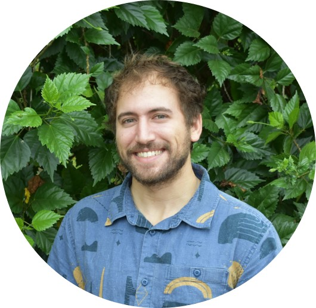

\ 
\ 

Greetings! I'm an ecologist, data scientist, and outdoor enthusiast. 

Welcome to my personal website for rambling on conservation research, wildlife, data science, and other miscellaneous musings.

I work as a Biologist with the Giant Tortoise Restoration Initiative at [Galapagos Conservancy](www.galapagos.org).

When not tinkering in R, you might find me flipping logs in a forest somewhere.

My full CV is available [here](C:/Users/Harrison/Documents/Website/Goldspiel_Harrison_CV_June_2020.pdf).